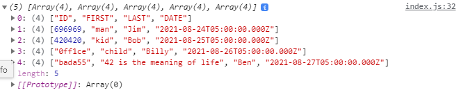
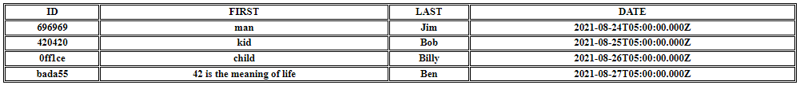

This is a working example of a Google Scripts API... 
1. Just download the Zip file. 
2. Extract. 
3. Navigate to this directory. 
4. Launch the index.html file in a server or on a local host...

For further reference, here is the google sheet: https://docs.google.com/spreadsheets/d/1kkxXL23Y8jvfhBSCYTtkC6G2FldEsykl347fA-AQQV8/edit?usp=sharing
